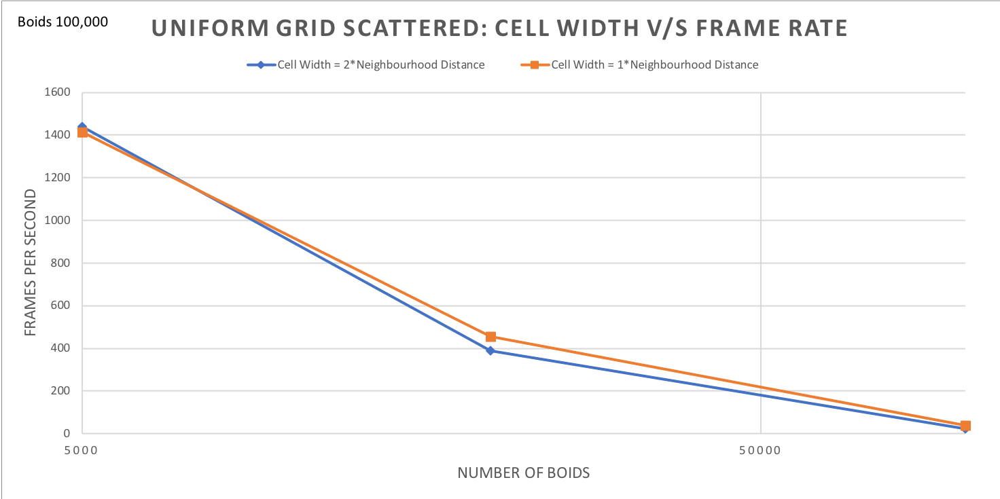

## Project 1 - Flocking
**University of Pennsylvania
CIS 565: GPU Programming and Architecture**

* Author: Chhavi Sharma ([LinkedIn](https://www.linkedin.com/in/chhavi275/))
* Tested on: Windows 10, Intel Core(R) Core(TM) i7-6700 CPU @ 3.40GHz 16GB, 
             NVIDIA Quadro P1000 4GB (MOORE100B-06)


### Index

- [Introduction](https://github.com/chhavisharma/Project1-CUDA-Flocking/blob/master/README.md#introduction)
- [Algorithm](https://github.com/chhavisharma/Project1-CUDA-Flocking/blob/master/README.md#algorithm)
- Implementations 
  - 1. [Naive Boid Simulation](https://github.com/chhavisharma/Project1-CUDA-Flocking/blob/master/README.md#naive-boid-simulation)
  - 2. [Boid Simulation with Scattered Uniform Grid Search](https://github.com/chhavisharma/Project1-CUDA-Flocking/blob/master/README.md#scattered-uniform-grid-search)
  - 3. [Boid Simulation with Coherent Uniform Grid Search](https://github.com/chhavisharma/Project1-CUDA-Flocking/blob/master/README.md#coherent-uniform-grid-search)
- [Performance Analysis](https://github.com/chhavisharma/Project1-CUDA-Flocking/blob/master/README.md#performance-analysis)
- [Q&A](https://github.com/chhavisharma/Project1-CUDA-Flocking/blob/master/README.md#qa)

### Introduction

This repository presents a CUDA accelerated implemtation of the [boids algorithm](https://en.wikipedia.org/wiki/Boids), developed by Craig Reynolds in 1986, which simulates the flocking behaviour of animals such as birds or fishes. Three versions of implementations with increasing levles of search optimization are shown: A naive search over all the neighbours, a scattered uniform grid search and a coherent unifrom grid search. 

An example of the resultant movement is shown below. Here, we try to simulate 200,000 boids using coherent uniform grid search optimization.
<p align="center">
  
</p>


### Algorithm

Boids is an example of emergent behavior; that is, the complexity of Boids arises from the interaction of individual boids adhering to a set of simple rules. 

    Cohesion - boids move towards the perceived center of mass of their neighbors
    Separation - boids avoid getting to close to their neighbors
    Alignment - boids generally try to move with the same direction and speed as their neighbors

These three rules specify a boid's velocity change in a timestep. At every timestep, a boid thus has to look at each of its neighboring boids and compute the velocity change contribution from each of the three rules. 

The pseudo code for the detialed algorithm that governs the movement of every boid at each timestamp is as follows:

```  
  // Variables to hold accumulated velocity per rule
  pCenter = 0
  pVel = 0
  pDist = 0
  cnt_pCenter = 0;
  cnt_pVel = 0;   
  
  for each b:
      // Rule 1: boids fly towards their local perceived center of mass, which excludes themselves
      if (b != iSelf and distance(pos[b],pos[iSelf]) < rule1Distance)
        pCenter += pos[b];
        cnt_pCenter += 1;

      // Rule 2: boids try to stay a distance d away from each other
      if( b != iSelf and distance(pos[b], pos[iSelf]) < rule2Distance)
        pDist -= (pos[b] - pos[iSelf]);

      // Rule 3: boids try to match the speed of surrounding boids
      if(b != iSelf and distance(pos[b], pos[iSelf]) < rule3Distance) {
        pVel += vel[b];
        cnt_pVel += 1;

  // Accumulated Averages
  if (cnt_pCenter != 0) 
    pCenter /= cnt_pCenter;
    pCenter = (pCenter - pos[iSelf])*rule1Scale;
  pDist = pDist * rule2Scale;
  if (cnt_pVel != 0) 
    pVel /= cnt_pVel;
    pVel = pVel * rule3Scale;

  // Return overall change in velocity!
  return pCenter + pDist + pVel;
```
For the purposes of an interesting simulation, we will say that two boids only influence each other according if they are within a certain neighborhood distance of each other defined by rule1Distance, rule2Distance and rule3Distance. 

### Naive Boid Simulation

In this implementation, for each boid, the full list of boids are searched to select neighbourhood boids for the velocity updates. This approch is not scalable and gets extremely compute intensive as the number of boids in the simulation grow. Relevant statistics are shown in the performance analysis section.  

### Scattered Uniform Grid Search

To speedup the search over neighbouring boids, the simulation space is discretised into girds (cuboids in 3D) and boids are assigned to these grids. Now, at the velocity update step, it is faster to resolve the neighbouring grids based on the rules and then check their residing boids for the velocity computation. 

To compute the neighbouring grids, we take sphere around the current boid(self) with the maximum allowable neighbourhood distance, which is a maximum over all distance rules, and figure out which grid cells intersect this sphere. The resultant collection of grid cells are then checked for boids to compute velocities. We also offset the origin of the simuation space from the center to the bottom left corner to avoid negative indices.
```sphere_radius = imax(rule3_distance, imax(rule1_distance, rule2_distance))```


Now, it is important to note that if the grid cell width is at least double the neighborhood distance, each boid only has to be checked against other boids in only 8 surrounding cells (4 in the 2D case shown below) out of the 26 surrounding cells. Whereas if the grid cell width is anywhere between twice the neighbourhood distance to the same as the neighbourhood distance, all 26 surrounding cells will have to checked for boids. And finally if the the grid cell width is lesser than the neighbourhood distance, a much larger number of grid-cells will have to be checked and it defeats the purpose of discretisation. **An extrememly large or extremely small grid cell width would not help optimize the search space. This approach is only helpful (could be optimal) when the ratio of cell width with the neighbourhood distance 2:1. **


#### Construction

We allocate arrays that hold the boid index and the grid index. We then construct the uniform grid by sorting. We sort the mapping of grid index and boid index arrays together with grid index as the key. As a result we get boid indices occouring in contiguous chunks of grid indices as shown in the picture below. 

Then, we can walk over the array of sorted uniform grid indices and look at every pair of values. If the values differ, we know that we are at the border of the representation of two different cells. Storing these locations in cellStartIndex and cellEndIndex arrays gives us o(1) access to all boids resisding in any grid. This process is data parallel and can be naively parallelized.


### Coherent Uniform Grid Search

The unifrom grid based search is further optimised by making sure that we have relevant values of position and velocity arrays in our cache which ensures more hits than misses during memory access. We do this by reshuffling the position and velocity arrays according to the particleArrayIndices after the sorting step in the previous case. Thus, at search time, 
the indices of grid cells are directly synchronised with position and velocity arrays and we cut out the 'middle man' particleArrayIndices. By rearranging the boid data itself so that all the velocities and positions of boids in one cell are also contiguous in memory, this data can be accessed directly using `dev_gridCellStartIndices` and `dev_gridCellEndIndices` without `dev_particleArrayIndices`.


### Performance Analysis

We measure performace by noting the FPS rate on the rendering window and track it with the changes in number of boids and  threads per block for each fo the three approaches described above.


1. We compare the change in frame rate with the change in the number of boids in out simulation for all three approaches.
The trend is shown in the graph below. This test was performed in Release mode with visualizations switched on and Nvidia Verstical Sync switched off.


As the numbe of boids grow the fps reduces since the velocity updates end up having more boids in the neighbourhood of every boid. More boids per cell over all result in higher compute and lower fps. 

2. We compare the change in frame rate with the change in the number of boids in out simulation for all three approaches.
The trend is shown in the graph below. This test was performed in Release mode with visualizations switched off and Nvidia Verstical Sync switched off.


The difference betwen this and the previous case is that the visualization was switched off while comuputing these numbers. As a result, the computational fps is not limited by the rendering and we se hiked numbers. 

3.We the plot the fps change as we increase the number of threads in each block. This test was performed on the Coherent implementation in Release mode with visualizations switched on and Nvidia Verstical Sync switched off.


We notice that there is hardly any change in performance as we increase threads per block. This is because the corresponding block count is reduced as threads are increased```fullBlocksPerGrid = (N + blockSize - 1) / blockSize ```.

4. We also plot the fps change as we switch the cell with from 2*neighbourhoodDistance to 1*neighbourhoodDistance for 100,000 BOids. This test was performed in Release mode with visualizations switched off and Nvidia Verstical Sync switched off.

Scattered (100000 Boids)             |  Coherent (100000 Boids) 
:-----------------------------------:|:-----------------------------------:
  |  

We see that the case where the cellwidth is equal to Neighbourhood distance (27 cell case) is performing slightly better than the 8-cell case (cell width == 2* Neighbourhood distance) for 100000 Boids. We note that in this particular case checking more number of cells does not reduce perfromce as the number of boids may be less per cell. 


#### Q&A:
* **For each implementation, how does changing the number of boids affect performance? Why do you think this is?**
* For the naive implementation, each boid iterates over every other boid to compute neighbours. Whereas in the scattered and uniform search implementations this check is reduced to a smaller number of boids limited by neighbouring grids. Therefore at each fixed boid count, we can see that Scattered Grid performs cosiderably better than Naive (due to space discretisation) and Coherent Grid performs somewhat better than Scattered (due to gridIndex-contiguous pos and vel arrays).  *In all cases though, as the boids grow in number, the fps drops, since more and more boids fall under the neighbourhood region of each boid, resulting in more compute.* Also, the relative fps speedup of the grid based algorithms as compared to the naive algorithm reduces as the number of boids grow. 

* **For each implementation, how does changing the block count and block size affect performance? Why do you think this is?**
* As we increase the the number of threads in each block, the total number of blocks launched is scaled down relatively. That is, ```fullBlocksPerGrid = (N + blockSize - 1) / blockSize ```. So if we increase threads per block, total blocks launched decreases and thus the parallelization is more or less the same in all cases except for the memory access(didffernt from within block to across block). Therefore, we can see from the plot above that the change is performace is very minor or negligible across all algorithms.

* **For the coherent uniform grid: did you experience any performance improvements with the more coherent uniform grid? Was this the outcome you expected? Why or why not?**
* We can observe considerable fps improvements from the scattered grid to coherent grid at higher boid counts(see boidCount=50k). This is because, when the pos and vel arrays are synchronised with the dev_gridCellIndices, the memory access brings in a continous chunk around the read array into cache. *The continuity of pos vel in memory and therefore in cahche allows for a faster access from cache per block in the coherent case.*
We do notice that there is a decline in fps for lower boid counts (see boidCount=5k). This is because the overhead of shuffling vel and pos arrays is more than the caching benifit we get from it possibly due to the small size of the number of boids. 

* **Did changing cell width and checking 27 vs 8 neighboring cells affect performance? Why or why not? Be careful: it is insufficient (and possibly incorrect) to say that 27-cell is slower simply because there are more cells to check!**
* In our particlar experiment in the plots, the case where 27 cells are checked (cell width == Neighbourhood distance) is performing slightly better than the 8-cell case (cell width == 2* Neighbourhood distance) for 100000 Boids. We note that in this particular case checking more number of cells does not reduce perfromce as the number of boids may be less per cell. Too large or too small cell width defetas the purpose of discretisation. Really largest cell width could encompass the entire space and give us the naive case, and, really small cell width would give us cell count ~= boid count and again give us the naive case. There has to be a balance between cell width and the neighbourhoodDistance such that the appropriate number of cells are checked. Therfore it is difficult to pick a case that should performe better. 

